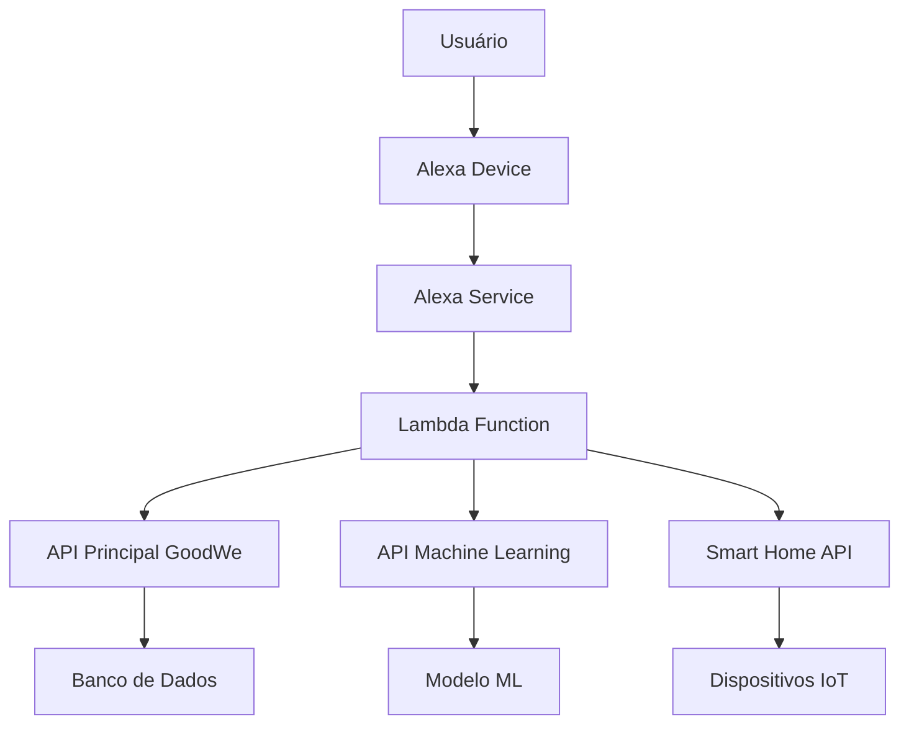

# Conceitos Básicos - Integração Alexa Skills GoodWe

## 📋 Visão Geral

Este documento apresenta os conceitos fundamentais necessários para entender e implementar a integração entre as APIs GoodWe e Amazon Alexa Skills, permitindo controle por voz de sistemas de energia solar.

## 🏗️ Arquitetura da Solução

### Componentes Principais



### Fluxo de Dados

1. **Comando de Voz**: Usuário fala com dispositivo Alexa
2. **Processamento**: Alexa Service converte fala em intents
3. **Lambda**: Função AWS processa intent e chama APIs
4. **APIs**: Integração com APIs GoodWe para dados
5. **Resposta**: Retorno processado para o usuário

## 🎯 Conceitos de Alexa Skills

### O que é uma Alexa Skill?

Uma Alexa Skill é uma aplicação de voz que estende as capacidades do Amazon Alexa, permitindo interações personalizadas através de comandos de voz.

### Componentes Essenciais

#### 1. Interaction Model
Define como a skill interpreta comandos de voz:
- **Intents**: Ações que a skill pode executar
- **Utterances**: Frases que ativam os intents
- **Slots**: Parâmetros extraídos dos comandos

#### 2. Lambda Function
Código backend que processa as requisições:
- **Node.js/Python**: Linguagens suportadas
- **AWS Lambda**: Serviço de computação serverless
- **Handlers**: Funções que processam intents específicos

#### 3. Smart Home API
Para controle de dispositivos IoT:
- **Discovery**: Descoberta de dispositivos
- **Control**: Controle de dispositivos
- **State Reporting**: Relatório de estados

## 🔧 Estrutura de Intents

### Categorias de Intents

#### 1. Intents de Monitoramento
```json
{
  "intent": "GetSystemStatus",
  "slots": [],
  "samples": [
    "qual o status do sistema",
    "como está o sistema solar",
    "status do sistema"
  ]
}
```

#### 2. Intents de Dados Energéticos
```json
{
  "intent": "GetEnergyGeneration",
  "slots": [
    {
      "name": "TimePeriod",
      "type": "AMAZON.Duration"
    }
  ],
  "samples": [
    "quanta energia estou gerando",
    "geração de energia agora",
    "quanto estou produzindo"
  ]
}
```

#### 3. Intents de Bateria
```json
{
  "intent": "GetBatteryLevel",
  "slots": [],
  "samples": [
    "qual o nível da bateria",
    "como está a bateria",
    "status da bateria"
  ]
}
```

#### 4. Intents de Análise
```json
{
  "intent": "GetEfficiencyAnalysis",
  "slots": [
    {
      "name": "AnalysisType",
      "type": "AnalysisType"
    }
  ],
  "samples": [
    "análise de eficiência",
    "como está a eficiência",
    "relatório de eficiência"
  ]
}
```

### Slots Personalizados

#### AnalysisType
```json
{
  "name": "AnalysisType",
  "values": [
    {
      "id": "daily",
      "name": {
        "value": "diária"
      }
    },
    {
      "id": "weekly", 
      "name": {
        "value": "semanal"
      }
    },
    {
      "id": "monthly",
      "name": {
        "value": "mensal"
      }
    }
  ]
}
```

#### EnergyMetric
```json
{
  "name": "EnergyMetric",
  "values": [
    {
      "id": "generation",
      "name": {
        "value": "geração"
      }
    },
    {
      "id": "consumption",
      "name": {
        "value": "consumo"
      }
    },
    {
      "id": "battery",
      "name": {
        "value": "bateria"
      }
    }
  ]
}
```

## 🗣️ Utterances e Padrões de Fala

### Padrões de Comandos

#### 1. Comandos Diretos
- "Alexa, qual o status do sistema?"
- "Alexa, quanta energia estou gerando?"
- "Alexa, como está a bateria?"

#### 2. Comandos com Parâmetros
- "Alexa, me mostre a geração de energia de hoje"
- "Alexa, qual a eficiência semanal?"
- "Alexa, me dê o relatório mensal"

#### 3. Comandos de Controle
- "Alexa, ative o modo de emergência"
- "Alexa, configure a bateria para modo econômico"
- "Alexa, agende manutenção para amanhã"

### Variações de Linguagem

#### Português Brasileiro
- Uso de "você" e "seu/sua"
- Contração de palavras
- Gírias regionais aceitas

#### Exemplos de Variações
```
"qual o status" → "como está o status"
"geração de energia" → "produção de energia"
"nível da bateria" → "carga da bateria"
```

## 🔌 Integração com APIs

### API Principal GoodWe

#### Endpoints Utilizados
```javascript
const API_ENDPOINTS = {
  // Dados básicos
  DATA: 'http://localhost:3000/data',
  DATA_PAGINATED: 'http://localhost:3000/data/paginated',
  DATA_HOUR: 'http://localhost:3000/data/hour',
  
  // Análises
  ANALYTICS_STATS: 'http://localhost:3000/analytics/stats',
  ANALYTICS_HOURLY: 'http://localhost:3000/analytics/hourly',
  ANALYTICS_EFFICIENCY: 'http://localhost:3000/analytics/efficiency',
  
  // Busca
  SEARCH_ADVANCED: 'http://localhost:3000/search/advanced',
  SEARCH_PEAKS: 'http://localhost:3000/search/peaks',
  SEARCH_ANOMALIES: 'http://localhost:3000/search/anomalies'
};
```

#### Tratamento de Respostas
```javascript
async function getSystemStatus() {
  try {
    const response = await fetch(`${API_BASE}/data/paginated?limit=1`);
    const data = await response.json();
    
    if (data.success) {
      return formatSystemStatus(data.data[0]);
    } else {
      throw new Error('Erro ao obter dados do sistema');
    }
  } catch (error) {
    console.error('Erro na API:', error);
    return 'Desculpe, não consegui obter o status do sistema';
  }
}
```

### API Machine Learning

#### Predições Climáticas
```javascript
async function getWeatherPrediction(weatherData) {
  try {
    const response = await fetch(`${ML_API_BASE}/predict`, {
      method: 'POST',
      headers: {
        'Content-Type': 'application/json'
      },
      body: JSON.stringify(weatherData)
    });
    
    const prediction = await response.json();
    return formatPrediction(prediction);
  } catch (error) {
    console.error('Erro na predição:', error);
    return 'Não foi possível obter a predição climática';
  }
}
```

## 🏠 Smart Home Integration

### Dispositivos Suportados

#### 1. Inversores Solares
```json
{
  "endpointId": "inverter-001",
  "friendlyName": "Inversor Principal",
  "description": "Inversor solar GoodWe",
  "manufacturerName": "GoodWe",
  "displayCategories": ["SWITCH"],
  "capabilities": [
    {
      "type": "AlexaInterface",
      "interface": "Alexa.PowerController",
      "properties": {
        "supported": [
          {
            "name": "powerState"
          }
        ]
      }
    }
  ]
}
```

#### 2. Baterias
```json
{
  "endpointId": "battery-001", 
  "friendlyName": "Bateria Solar",
  "description": "Sistema de baterias GoodWe",
  "manufacturerName": "GoodWe",
  "displayCategories": ["BATTERY"],
  "capabilities": [
    {
      "type": "AlexaInterface",
      "interface": "Alexa.PercentageController",
      "properties": {
        "supported": [
          {
            "name": "percentage"
          }
        ]
      }
    }
  ]
}
```

### Controles por Voz

#### Comandos de Controle
- "Alexa, ligue o inversor"
- "Alexa, desligue o sistema solar"
- "Alexa, configure a bateria para 80%"
- "Alexa, ative o modo de emergência"

## 📊 Estrutura de Dados

### Formato de Resposta Padrão

```javascript
const responseFormat = {
  version: "1.0",
  response: {
    outputSpeech: {
      type: "SSML",
      ssml: "<speak>Resposta formatada</speak>"
    },
    card: {
      type: "Standard",
      title: "Título da Resposta",
      content: "Conteúdo detalhado",
      image: {
        smallImageUrl: "url_imagem_pequena",
        largeImageUrl: "url_imagem_grande"
      }
    },
    shouldEndSession: false
  }
};
```

### Tratamento de Erros

```javascript
function createErrorResponse(errorMessage) {
  return {
    version: "1.0",
    response: {
      outputSpeech: {
        type: "PlainText",
        text: errorMessage
      },
      shouldEndSession: true
    }
  };
}
```

## 🔒 Segurança e Autenticação

### Autenticação de APIs

#### API Keys
```javascript
const API_CONFIG = {
  goodwe: {
    baseUrl: process.env.GOODWE_API_URL,
    apiKey: process.env.GOODWE_API_KEY,
    timeout: 5000
  },
  ml: {
    baseUrl: process.env.ML_API_URL,
    apiKey: process.env.ML_API_KEY,
    timeout: 10000
  }
};
```

#### Rate Limiting
```javascript
const rateLimiter = {
  requests: new Map(),
  maxRequests: 100,
  windowMs: 60000, // 1 minuto
  
  isAllowed(userId) {
    const now = Date.now();
    const userRequests = this.requests.get(userId) || [];
    
    // Remove requisições antigas
    const recentRequests = userRequests.filter(
      time => now - time < this.windowMs
    );
    
    if (recentRequests.length >= this.maxRequests) {
      return false;
    }
    
    recentRequests.push(now);
    this.requests.set(userId, recentRequests);
    return true;
  }
};
```

## 📱 Experiência do Usuário

### Design de Conversação

#### 1. Saudações e Despedidas
```javascript
const GREETINGS = [
  "Olá! Como posso ajudar com seu sistema solar?",
  "Bem-vindo ao assistente GoodWe!",
  "Sistema solar conectado. Em que posso ajudar?"
];

const GOODBYES = [
  "Até logo! Seu sistema solar está monitorado.",
  "Tchau! Qualquer coisa, é só chamar.",
  "Até a próxima! Energia solar sempre funcionando."
];
```

#### 2. Confirmações e Feedback
```javascript
function createConfirmation(message, action) {
  return {
    version: "1.0",
    response: {
      outputSpeech: {
        type: "SSML",
        ssml: `<speak>${message}</speak>`
      },
      reprompt: {
        outputSpeech: {
          type: "PlainText",
          text: "Posso ajudar com mais alguma coisa?"
        }
      },
      shouldEndSession: false
    }
  };
}
```

### Personalização

#### Perfis de Usuário
```javascript
const userProfiles = {
  'user123': {
    name: 'João',
    preferences: {
      language: 'pt-BR',
      timezone: 'America/Sao_Paulo',
      units: 'metric',
      notifications: true
    },
    systemConfig: {
      inverterId: 'inverter-001',
      batteryId: 'battery-001',
      alertThresholds: {
        lowBattery: 20,
        highGeneration: 80
      }
    }
  }
};
```

## 🧪 Testes e Validação

### Testes de Intents

#### Teste Básico
```javascript
const testCases = [
  {
    input: "qual o status do sistema",
    expectedIntent: "GetSystemStatus",
    expectedSlots: {}
  },
  {
    input: "quanta energia estou gerando hoje",
    expectedIntent: "GetEnergyGeneration", 
    expectedSlots: {
      TimePeriod: "today"
    }
  }
];
```

#### Teste de Integração
```javascript
async function testAPIIntegration() {
  try {
    // Teste API Principal
    const systemStatus = await getSystemStatus();
    console.assert(systemStatus !== null, 'Status do sistema deve ser obtido');
    
    // Teste API ML
    const prediction = await getWeatherPrediction(testWeatherData);
    console.assert(prediction.probability !== undefined, 'Predição deve ter probabilidade');
    
    console.log('✅ Todos os testes de integração passaram');
  } catch (error) {
    console.error('❌ Teste de integração falhou:', error);
  }
}
```

## 📈 Monitoramento e Logs

### Estrutura de Logs

```javascript
const logger = {
  info: (message, data = {}) => {
    console.log(JSON.stringify({
      timestamp: new Date().toISOString(),
      level: 'INFO',
      message,
      data
    }));
  },
  
  error: (message, error = {}) => {
    console.error(JSON.stringify({
      timestamp: new Date().toISOString(),
      level: 'ERROR', 
      message,
      error: {
        name: error.name,
        message: error.message,
        stack: error.stack
      }
    }));
  }
};
```

### Métricas Importantes

- **Taxa de Sucesso**: % de comandos executados com sucesso
- **Tempo de Resposta**: Latência média das APIs
- **Uso de Intents**: Frequência de uso de cada intent
- **Erros**: Categorização e frequência de erros

---

**Próximo**: [Guia de Desenvolvimento](./02-desenvolvimento.md)
