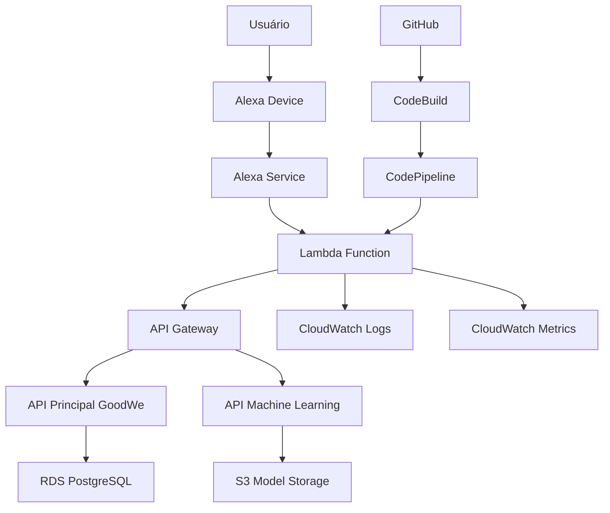

# Guia de Deployment - Alexa Skills GoodWe

## 📋 Visão Geral

Este guia fornece instruções completas para fazer deploy da Alexa Skill GoodWe em ambiente de produção, incluindo configuração da AWS, CI/CD e monitoramento.

## 🏗️ Arquitetura de Deploy

### Componentes da Infraestrutura



### Stack de Deploy

- **AWS Lambda**: Função principal da skill
- **API Gateway**: Proxy para APIs externas
- **RDS PostgreSQL**: Banco de dados para APIs
- **S3**: Armazenamento de modelos ML
- **CloudWatch**: Logs e métricas
- **CodePipeline**: CI/CD automatizado

## 🚀 Deploy Manual

### 1. Preparação do Ambiente

#### Configuração AWS CLI
```bash
# Instalar AWS CLI
pip install awscli

# Configurar credenciais
aws configure
# AWS Access Key ID: [sua-access-key]
# AWS Secret Access Key: [sua-secret-key]
# Default region name: us-east-1
# Default output format: json

# Verificar configuração
aws sts get-caller-identity
```

#### Configuração ASK CLI
```bash
# Instalar ASK CLI
npm install -g ask-cli

# Configurar perfil
ask configure
# Please create a new profile or overwrite the existing profile.
# Profile name: goodwe-skill
# ASK CLI region: us-east-1
# AWS profile name: default
# VENDOR ID: [seu-vendor-id]
```

### 2. Deploy da Lambda Function

#### Criar Função Lambda
```bash
# Criar função Lambda
aws lambda create-function \
  --function-name GoodWeSolarAssistant \
  --runtime nodejs18.x \
  --role arn:aws:iam::123456789012:role/lambda-execution-role \
  --handler index.handler \
  --zip-file fileb://lambda-deployment-package.zip \
  --timeout 30 \
  --memory-size 256
```

#### Configurar Variáveis de Ambiente
```bash
# Configurar variáveis de ambiente
aws lambda update-function-configuration \
  --function-name GoodWeSolarAssistant \
  --environment Variables='{
    "GOODWE_API_URL":"https://api.goodwe.com",
    "ML_API_URL":"https://ml-api.goodwe.com",
    "WEATHER_API_KEY":"sua-weather-api-key",
    "DEBUG":"false",
    "LOG_LEVEL":"info"
  }'
```

#### Deploy do Código
```bash
# Criar pacote de deploy
cd lambda
npm install --production
zip -r ../lambda-deployment-package.zip .

# Atualizar função
aws lambda update-function-code \
  --function-name GoodWeSolarAssistant \
  --zip-file fileb://../lambda-deployment-package.zip
```

### 3. Deploy da Skill

#### Deploy Completo
```bash
# Deploy da skill completa
ask deploy

# Deploy apenas da Lambda
ask deploy --target lambda

# Deploy apenas do modelo de interação
ask deploy --target model
```

#### Verificar Deploy
```bash
# Verificar status da skill
ask get-skill-status

# Testar skill
ask simulate --text "qual o status do sistema" --locale pt-BR
```

## 🔄 Deploy Automatizado com CI/CD

### 1. Configuração do GitHub Actions

#### Arquivo .github/workflows/deploy.yml
```yaml
name: Deploy GoodWe Alexa Skill

on:
  push:
    branches: [ main, develop ]
  pull_request:
    branches: [ main ]

env:
  AWS_REGION: us-east-1
  LAMBDA_FUNCTION_NAME: GoodWeSolarAssistant

jobs:
  test:
    runs-on: ubuntu-latest
    steps:
    - uses: actions/checkout@v3
    
    - name: Setup Node.js
      uses: actions/setup-node@v3
      with:
        node-version: '18'
        cache: 'npm'
        cache-dependency-path: lambda/package.json
    
    - name: Install dependencies
      run: |
        cd lambda
        npm ci
    
    - name: Run tests
      run: |
        cd lambda
        npm test
    
    - name: Lint code
      run: |
        cd lambda
        npm run lint

  deploy-staging:
    needs: test
    runs-on: ubuntu-latest
    if: github.ref == 'refs/heads/develop'
    environment: staging
    
    steps:
    - uses: actions/checkout@v3
    
    - name: Setup Node.js
      uses: actions/setup-node@v3
      with:
        node-version: '18'
    
    - name: Setup ASK CLI
      run: |
        npm install -g ask-cli
    
    - name: Configure AWS credentials
      uses: aws-actions/configure-aws-credentials@v2
      with:
        aws-access-key-id: ${{ secrets.AWS_ACCESS_KEY_ID }}
        aws-secret-access-key: ${{ secrets.AWS_SECRET_ACCESS_KEY }}
        aws-region: ${{ env.AWS_REGION }}
    
    - name: Deploy to staging
      run: |
        ask deploy --target lambda --profile staging
      env:
        ASK_VENDOR_ID: ${{ secrets.ASK_VENDOR_ID }}

  deploy-production:
    needs: test
    runs-on: ubuntu-latest
    if: github.ref == 'refs/heads/main'
    environment: production
    
    steps:
    - uses: actions/checkout@v3
    
    - name: Setup Node.js
      uses: actions/setup-node@v3
      with:
        node-version: '18'
    
    - name: Setup ASK CLI
      run: |
        npm install -g ask-cli
    
    - name: Configure AWS credentials
      uses: aws-actions/configure-aws-credentials@v2
      with:
        aws-access-key-id: ${{ secrets.AWS_ACCESS_KEY_ID }}
        aws-secret-access-key: ${{ secrets.AWS_SECRET_ACCESS_KEY }}
        aws-region: ${{ env.AWS_REGION }}
    
    - name: Deploy to production
      run: |
        ask deploy --profile production
      env:
        ASK_VENDOR_ID: ${{ secrets.ASK_VENDOR_ID }}
    
    - name: Run integration tests
      run: |
        npm run test:integration
    
    - name: Notify deployment
      uses: 8398a7/action-slack@v3
      with:
        status: ${{ job.status }}
        channel: '#deployments'
        webhook_url: ${{ secrets.SLACK_WEBHOOK }}
```

### 2. Configuração de Ambientes

#### Ambiente de Staging
```bash
# Configurar perfil de staging
ask configure --profile staging
# Profile name: staging
# ASK CLI region: us-east-1
# AWS profile name: staging
# VENDOR ID: [seu-vendor-id]

# Deploy para staging
ask deploy --profile staging
```

#### Ambiente de Produção
```bash
# Configurar perfil de produção
ask configure --profile production
# Profile name: production
# ASK CLI region: us-east-1
# AWS profile name: production
# VENDOR ID: [seu-vendor-id]

# Deploy para produção
ask deploy --profile production
```

### 3. Configuração de Secrets

#### GitHub Secrets
```bash
# Configurar secrets no GitHub
# AWS_ACCESS_KEY_ID: [sua-access-key]
# AWS_SECRET_ACCESS_KEY: [sua-secret-key]
# ASK_VENDOR_ID: [seu-vendor-id]
# WEATHER_API_KEY: [sua-weather-api-key]
# SLACK_WEBHOOK: [seu-slack-webhook]
```

## 🐳 Deploy com Docker

### 1. Dockerfile para Lambda

```dockerfile
# Dockerfile.lambda
FROM public.ecr.aws/lambda/nodejs:18

# Copiar código
COPY lambda/ ${LAMBDA_TASK_ROOT}/

# Instalar dependências
RUN npm ci --only=production

# Configurar handler
CMD ["index.handler"]
```

### 2. Build e Deploy com Docker

```bash
# Build da imagem
docker build -f Dockerfile.lambda -t goodwe-alexa-skill .

# Tag para ECR
docker tag goodwe-alexa-skill:latest 123456789012.dkr.ecr.us-east-1.amazonaws.com/goodwe-alexa-skill:latest

# Push para ECR
aws ecr get-login-password --region us-east-1 | docker login --username AWS --password-stdin 123456789012.dkr.ecr.us-east-1.amazonaws.com
docker push 123456789012.dkr.ecr.us-east-1.amazonaws.com/goodwe-alexa-skill:latest

# Atualizar função Lambda
aws lambda update-function-code \
  --function-name GoodWeSolarAssistant \
  --image-uri 123456789012.dkr.ecr.us-east-1.amazonaws.com/goodwe-alexa-skill:latest
```

## 📊 Monitoramento e Observabilidade

### 1. CloudWatch Logs

#### Configuração de Logs
```javascript
// Configuração de logging estruturado
const winston = require('winston');

const logger = winston.createLogger({
  level: process.env.LOG_LEVEL || 'info',
  format: winston.format.combine(
    winston.format.timestamp(),
    winston.format.errors({ stack: true }),
    winston.format.json()
  ),
  transports: [
    new winston.transports.Console(),
    new winston.transports.File({ filename: 'error.log', level: 'error' }),
    new winston.transports.File({ filename: 'combined.log' })
  ]
});

// Uso do logger
logger.info('Intent processado', {
  intent: 'GetSystemStatus',
  userId: 'user123',
  timestamp: new Date().toISOString()
});
```

#### Configuração de Log Groups
```bash
# Criar log group
aws logs create-log-group \
  --log-group-name /aws/lambda/GoodWeSolarAssistant

# Configurar retenção
aws logs put-retention-policy \
  --log-group-name /aws/lambda/GoodWeSolarAssistant \
  --retention-in-days 30
```

### 2. CloudWatch Metrics

#### Métricas Personalizadas
```javascript
const AWS = require('aws-sdk');
const cloudwatch = new AWS.CloudWatch();

// Enviar métricas personalizadas
async function sendCustomMetric(metricName, value, unit = 'Count') {
  try {
    await cloudwatch.putMetricData({
      Namespace: 'GoodWe/AlexaSkill',
      MetricData: [{
        MetricName: metricName,
        Value: value,
        Unit: unit,
        Timestamp: new Date(),
        Dimensions: [
          {
            Name: 'FunctionName',
            Value: 'GoodWeSolarAssistant'
          }
        ]
      }]
    }).promise();
  } catch (error) {
    console.error('Erro ao enviar métrica:', error);
  }
}

// Exemplos de métricas
await sendCustomMetric('IntentProcessed', 1, 'Count');
await sendCustomMetric('APIResponseTime', 1500, 'Milliseconds');
await sendCustomMetric('ErrorRate', 0.05, 'Percent');
```

#### Dashboard do CloudWatch
```json
{
  "widgets": [
    {
      "type": "metric",
      "properties": {
        "metrics": [
          ["AWS/Lambda", "Invocations", "FunctionName", "GoodWeSolarAssistant"],
          [".", "Errors", ".", "."],
          [".", "Duration", ".", "."]
        ],
        "period": 300,
        "stat": "Average",
        "region": "us-east-1",
        "title": "Lambda Performance"
      }
    },
    {
      "type": "metric",
      "properties": {
        "metrics": [
          ["GoodWe/AlexaSkill", "IntentProcessed"],
          [".", "APIResponseTime"],
          [".", "ErrorRate"]
        ],
        "period": 300,
        "stat": "Average",
        "region": "us-east-1",
        "title": "Custom Metrics"
      }
    }
  ]
}
```

### 3. Alertas e Notificações

#### Configuração de Alarmes
```bash
# Alarme para erros
aws cloudwatch put-metric-alarm \
  --alarm-name "GoodWe-Lambda-Errors" \
  --alarm-description "Alarme para erros na Lambda" \
  --metric-name Errors \
  --namespace AWS/Lambda \
  --statistic Sum \
  --period 300 \
  --threshold 5 \
  --comparison-operator GreaterThanThreshold \
  --evaluation-periods 2 \
  --alarm-actions arn:aws:sns:us-east-1:123456789012:goodwe-alerts

# Alarme para duração
aws cloudwatch put-metric-alarm \
  --alarm-name "GoodWe-Lambda-Duration" \
  --alarm-description "Alarme para duração alta na Lambda" \
  --metric-name Duration \
  --namespace AWS/Lambda \
  --statistic Average \
  --period 300 \
  --threshold 10000 \
  --comparison-operator GreaterThanThreshold \
  --evaluation-periods 2 \
  --alarm-actions arn:aws:sns:us-east-1:123456789012:goodwe-alerts
```

#### Configuração de SNS
```bash
# Criar tópico SNS
aws sns create-topic --name goodwe-alerts

# Criar subscription
aws sns subscribe \
  --topic-arn arn:aws:sns:us-east-1:123456789012:goodwe-alerts \
  --protocol email \
  --notification-endpoint admin@goodwe.com
```

## 🔒 Segurança e Compliance

### 1. Configuração de IAM

#### Role para Lambda
```json
{
  "Version": "2012-10-17",
  "Statement": [
    {
      "Effect": "Allow",
      "Action": [
        "logs:CreateLogGroup",
        "logs:CreateLogStream",
        "logs:PutLogEvents"
      ],
      "Resource": "arn:aws:logs:*:*:*"
    },
    {
      "Effect": "Allow",
      "Action": [
        "cloudwatch:PutMetricData"
      ],
      "Resource": "*"
    },
    {
      "Effect": "Allow",
      "Action": [
        "sns:Publish"
      ],
      "Resource": "arn:aws:sns:us-east-1:123456789012:goodwe-alerts"
    }
  ]
}
```

#### Política de Segurança
```json
{
  "Version": "2012-10-17",
  "Statement": [
    {
      "Effect": "Deny",
      "Action": "*",
      "Resource": "*",
      "Condition": {
        "StringNotEquals": {
          "aws:RequestedRegion": "us-east-1"
        }
      }
    }
  ]
}
```

### 2. Criptografia e Secrets

#### AWS Secrets Manager
```bash
# Criar secret para API keys
aws secretsmanager create-secret \
  --name "goodwe/api-keys" \
  --description "API keys para GoodWe" \
  --secret-string '{"goodwe_api_key":"sua-key","weather_api_key":"sua-key"}'

# Recuperar secret no código
const AWS = require('aws-sdk');
const secretsManager = new AWS.SecretsManager();

async function getSecret(secretName) {
  try {
    const result = await secretsManager.getSecretValue({
      SecretId: secretName
    }).promise();
    
    return JSON.parse(result.SecretString);
  } catch (error) {
    console.error('Erro ao recuperar secret:', error);
    throw error;
  }
}
```

## 📈 Otimização de Performance

### 1. Otimização da Lambda

#### Configuração de Memória
```bash
# Otimizar memória baseada no uso
aws lambda update-function-configuration \
  --function-name GoodWeSolarAssistant \
  --memory-size 512
```

#### Connection Pooling
```javascript
// Pool de conexões para APIs
const axios = require('axios');

const apiClient = axios.create({
  baseURL: process.env.GOODWE_API_URL,
  timeout: 5000,
  maxRedirects: 5,
  // Pool de conexões
  httpAgent: new require('http').Agent({
    keepAlive: true,
    maxSockets: 10
  }),
  httpsAgent: new require('https').Agent({
    keepAlive: true,
    maxSockets: 10
  })
});
```

### 2. Cache e Otimização

#### Cache de Respostas
```javascript
// Cache simples em memória
const cache = new Map();

function getCachedResponse(key, ttl = 300000) { // 5 minutos
  const cached = cache.get(key);
  if (cached && Date.now() - cached.timestamp < ttl) {
    return cached.data;
  }
  return null;
}

function setCachedResponse(key, data) {
  cache.set(key, {
    data,
    timestamp: Date.now()
  });
}
```

## 🧪 Testes de Deploy

### 1. Testes de Integração

#### Script de Teste Pós-Deploy
```javascript
// test-post-deploy.js
const axios = require('axios');

async function testDeployment() {
  console.log('🧪 Testando deploy...');
  
  const testCases = [
    {
      name: 'Health Check',
      test: async () => {
        const response = await axios.get('https://api.goodwe.com/health');
        return response.status === 200;
      }
    },
    {
      name: 'Lambda Invocation',
      test: async () => {
        const lambda = new AWS.Lambda();
        const result = await lambda.invoke({
          FunctionName: 'GoodWeSolarAssistant',
          Payload: JSON.stringify({
            request: {
              type: 'LaunchRequest'
            }
          })
        }).promise();
        
        return result.StatusCode === 200;
      }
    }
  ];
  
  for (const testCase of testCases) {
    try {
      const result = await testCase.test();
      console.log(`${result ? '✅' : '❌'} ${testCase.name}`);
    } catch (error) {
      console.log(`❌ ${testCase.name}: ${error.message}`);
    }
  }
}

testDeployment();
```

### 2. Testes de Performance

#### Load Testing
```bash
# Instalar Artillery
npm install -g artillery

# Configurar teste de carga
cat > load-test.yml << EOF
config:
  target: 'https://api.goodwe.com'
  phases:
    - duration: 60
      arrivalRate: 10
scenarios:
  - name: "Test API endpoints"
    requests:
      - get:
          url: "/health"
      - get:
          url: "/data/paginated?limit=1"
EOF

# Executar teste
artillery run load-test.yml
```

## 🔄 Rollback e Recuperação

### 1. Estratégia de Rollback

#### Script de Rollback
```bash
#!/bin/bash
# rollback.sh

FUNCTION_NAME="GoodWeSolarAssistant"
BACKUP_BUCKET="goodwe-lambda-backups"

echo "🔄 Iniciando rollback..."

# Listar versões disponíveis
aws lambda list-versions-by-function --function-name $FUNCTION_NAME

# Fazer rollback para versão anterior
aws lambda update-alias \
  --function-name $FUNCTION_NAME \
  --name PROD \
  --function-version $1

echo "✅ Rollback concluído para versão $1"
```

#### Backup Automático
```bash
# Script de backup
#!/bin/bash
# backup.sh

FUNCTION_NAME="GoodWeSolarAssistant"
BACKUP_BUCKET="goodwe-lambda-backups"
TIMESTAMP=$(date +%Y%m%d_%H%M%S)

# Fazer backup da versão atual
aws lambda get-function --function-name $FUNCTION_NAME > backup_${TIMESTAMP}.json

# Upload para S3
aws s3 cp backup_${TIMESTAMP}.json s3://$BACKUP_BUCKET/

echo "✅ Backup criado: backup_${TIMESTAMP}.json"
```

---

**Próximo**: [Casos Avançados](./05-casos-avancados.md)
