# Guia de Integração - APIs GoodWe

Este guia fornece instruções completas para integrar as APIs GoodWe, demonstrando como elas podem trabalhar em conjunto para criar um sistema completo de monitoramento e predição de energia.

## 📋 Visão Geral da Integração

O sistema GoodWe é composto por duas APIs complementares:

- **API Principal GoodWe** (Node.js) - Porta 3000
  - Conversão de dados Excel
  - Gerenciamento de arquivos
  - Interface de dados

- **API Machine Learning** (Python) - Porta 8000
  - Predição de quedas de energia
  - Análise de condições climáticas
  - Modelo de IA treinado

## 🔗 Fluxo de Integração

```mermaid
graph TD
    A[Arquivo Excel] --> B[API Principal]
    B --> C[Conversão para JSON]
    C --> D[Dados Climáticos]
    D --> E[API Machine Learning]
    E --> F[Predição de Queda]
    F --> G[Resultado Final]
    
    H[Dashboard] --> B
    H --> E
    I[Monitoramento] --> B
    I --> E
```



## 🚀 Configuração da Integração

### 1. Iniciar Ambas as APIs

#### Terminal 1 - API Principal
```bash
cd API_GoodWe
npm install
npm start
```

#### Terminal 2 - API Machine Learning
```bash
cd Machine_learning_GoodWe
python -m venv venv
source venv/bin/activate  # Linux/Mac
# ou venv\Scripts\activate  # Windows
pip install -r requirements.txt
python start_api.py
```

### 2. Verificar Funcionamento
```bash
# API Principal
curl http://localhost:3000/health

# API Machine Learning
curl http://localhost:8000/health
```

## 🔄 Exemplos de Integração

### 1. Fluxo Completo: Excel → Conversão → Predição

#### JavaScript/Node.js
```javascript
const axios = require('axios');

class GoodWeIntegration {
  constructor() {
    this.apiPrincipal = 'http://localhost:3000';
    this.apiML = 'http://localhost:8000';
  }

  // 1. Converter arquivo Excel
  async convertExcelFile() {
    try {
      const response = await axios.get(`${this.apiPrincipal}/excel/convert`);
      console.log('Arquivo convertido:', response.data.message);
      return response.data.data;
    } catch (error) {
      console.error('Erro na conversão:', error.message);
      throw error;
    }
  }

  // 2. Extrair dados climáticos do JSON convertido
  extractWeatherData(excelData) {
    // Assumindo que os dados climáticos estão na primeira planilha
    const sheetData = excelData.Sheet1 || excelData[Object.keys(excelData)[0]];
    
    // Encontrar linha de cabeçalho
    const headerRow = sheetData.find(row => 
      row.some(cell => cell && cell.toString().toLowerCase().includes('temperatura'))
    );
    
    if (!headerRow) {
      throw new Error('Dados climáticos não encontrados no arquivo');
    }

    const headerIndex = sheetData.indexOf(headerRow);
    const dataRows = sheetData.slice(headerIndex + 1);

    // Mapear dados para o formato esperado pela API ML
    const weatherData = dataRows.map(row => ({
      temperatura_celsius: parseFloat(row[0]) || 0,
      umidade_pct: parseFloat(row[1]) || 0,
      precipitacao_mm_h: parseFloat(row[2]) || 0,
      vento_kmh: parseFloat(row[3]) || 0,
      pressao_hpa: parseFloat(row[4]) || 1013
    }));

    return weatherData;
  }

  // 3. Fazer predições usando API ML
  async predictPowerOutages(weatherData) {
    try {
      const predictions = [];
      
      for (const data of weatherData) {
        const response = await axios.post(`${this.apiML}/predict`, data);
        predictions.push(response.data);
      }
      
      return predictions;
    } catch (error) {
      console.error('Erro na predição:', error.message);
      throw error;
    }
  }

  // 4. Fluxo completo
  async processCompleteFlow() {
    try {
      console.log('🔄 Iniciando fluxo completo...');
      
      // Passo 1: Converter Excel
      console.log('📊 Convertendo arquivo Excel...');
      const excelData = await this.convertExcelFile();
      
      // Passo 2: Extrair dados climáticos
      console.log('🌤️ Extraindo dados climáticos...');
      const weatherData = this.extractWeatherData(excelData);
      
      // Passo 3: Fazer predições
      console.log('🤖 Fazendo predições...');
      const predictions = await this.predictPowerOutages(weatherData);
      
      // Passo 4: Analisar resultados
      console.log('📈 Analisando resultados...');
      const analysis = this.analyzePredictions(predictions);
      
      return {
        excelData,
        weatherData,
        predictions,
        analysis
      };
      
    } catch (error) {
      console.error('❌ Erro no fluxo completo:', error.message);
      throw error;
    }
  }

  // 5. Analisar predições
  analyzePredictions(predictions) {
    const total = predictions.length;
    const highRisk = predictions.filter(p => p.nivel_risco === 'Alto' || p.nivel_risco === 'Crítico').length;
    const avgProbability = predictions.reduce((sum, p) => sum + p.probabilidade, 0) / total;
    
    return {
      totalPredictions: total,
      highRiskCount: highRisk,
      highRiskPercentage: (highRisk / total * 100).toFixed(1),
      averageProbability: (avgProbability * 100).toFixed(1),
      riskDistribution: this.getRiskDistribution(predictions)
    };
  }

  getRiskDistribution(predictions) {
    const distribution = {
      'Baixo': 0,
      'Médio': 0,
      'Alto': 0,
      'Crítico': 0
    };
    
    predictions.forEach(p => {
      distribution[p.nivel_risco]++;
    });
    
    return distribution;
  }
}

// Uso da integração
async function main() {
  const integration = new GoodWeIntegration();
  
  try {
    const result = await integration.processCompleteFlow();
    
    console.log('\n📊 RESULTADOS FINAIS:');
    console.log('==================');
    console.log(`Total de predições: ${result.analysis.totalPredictions}`);
    console.log(`Alto risco: ${result.analysis.highRiskCount} (${result.analysis.highRiskPercentage}%)`);
    console.log(`Probabilidade média: ${result.analysis.averageProbability}%`);
    console.log('\nDistribuição de risco:');
    Object.entries(result.analysis.riskDistribution).forEach(([risk, count]) => {
      console.log(`  ${risk}: ${count}`);
    });
    
  } catch (error) {
    console.error('Erro:', error.message);
  }
}

main();
```

### 2. Integração com Frontend (React)

```jsx
import React, { useState, useEffect } from 'react';
import axios from 'axios';

const GoodWeDashboard = () => {
  const [excelData, setExcelData] = useState(null);
  const [predictions, setPredictions] = useState([]);
  const [loading, setLoading] = useState(false);
  const [error, setError] = useState(null);

  const API_PRINCIPAL = 'http://localhost:3000';
  const API_ML = 'http://localhost:8000';

  // Converter arquivo Excel
  const convertExcel = async () => {
    try {
      setLoading(true);
      const response = await axios.get(`${API_PRINCIPAL}/excel/convert`);
      setExcelData(response.data);
      return response.data;
    } catch (err) {
      setError('Erro ao converter arquivo Excel');
      throw err;
    } finally {
      setLoading(false);
    }
  };

  // Fazer predição individual
  const predictSingle = async (weatherData) => {
    try {
      const response = await axios.post(`${API_ML}/predict`, weatherData);
      return response.data;
    } catch (err) {
      setError('Erro na predição');
      throw err;
    }
  };

  // Fazer predições em lote
  const predictBatch = async (weatherDataList) => {
    try {
      const response = await axios.post(`${API_ML}/predict-batch`, weatherDataList);
      return response.data.predictions;
    } catch (err) {
      setError('Erro nas predições em lote');
      throw err;
    }
  };

  // Processar dados do Excel
  const processExcelData = (data) => {
    // Extrair dados climáticos do JSON convertido
    const sheetData = data.data.Sheet1 || data.data[Object.keys(data.data)[0]];
    
    // Converter para formato da API ML
    const weatherData = sheetData.slice(1).map(row => ({
      temperatura_celsius: parseFloat(row[0]) || 0,
      umidade_pct: parseFloat(row[1]) || 0,
      precipitacao_mm_h: parseFloat(row[2]) || 0,
      vento_kmh: parseFloat(row[3]) || 0,
      pressao_hpa: parseFloat(row[4]) || 1013
    }));

    return weatherData;
  };

  // Fluxo completo
  const runCompleteAnalysis = async () => {
    try {
      setLoading(true);
      setError(null);

      // 1. Converter Excel
      const excelResult = await convertExcel();
      
      // 2. Processar dados
      const weatherData = processExcelData(excelResult);
      
      // 3. Fazer predições
      const predictionsResult = await predictBatch(weatherData);
      setPredictions(predictionsResult);

    } catch (err) {
      console.error('Erro no fluxo completo:', err);
    } finally {
      setLoading(false);
    }
  };

  // Verificar status das APIs
  const checkAPIStatus = async () => {
    try {
      const [principalStatus, mlStatus] = await Promise.all([
        axios.get(`${API_PRINCIPAL}/health`),
        axios.get(`${API_ML}/health`)
      ]);
      
      return {
        principal: principalStatus.data.status === 'OK',
        ml: mlStatus.data.status === 'healthy'
      };
    } catch (err) {
      return { principal: false, ml: false };
    }
  };

  useEffect(() => {
    checkAPIStatus().then(status => {
      console.log('Status das APIs:', status);
    });
  }, []);

  return (
    <div className="dashboard">
      <h1>GoodWe - Dashboard de Integração</h1>
      
      {error && (
        <div className="error">
          <p>❌ {error}</p>
        </div>
      )}

      <div className="controls">
        <button 
          onClick={runCompleteAnalysis}
          disabled={loading}
          className="primary-button"
        >
          {loading ? 'Processando...' : 'Executar Análise Completa'}
        </button>
      </div>

      {predictions.length > 0 && (
        <div className="results">
          <h2>Resultados das Predições</h2>
          <div className="summary">
            <p>Total: {predictions.length}</p>
            <p>Alto Risco: {predictions.filter(p => p.nivel_risco === 'Alto' || p.nivel_risco === 'Crítico').length}</p>
          </div>
          
          <div className="predictions-grid">
            {predictions.map((prediction, index) => (
              <div key={index} className={`prediction-card ${prediction.nivel_risco.toLowerCase()}`}>
                <h3>Predição #{index + 1}</h3>
                <p><strong>Risco:</strong> {prediction.nivel_risco}</p>
                <p><strong>Probabilidade:</strong> {prediction.probabilidade_pct}</p>
                <p><strong>Queda:</strong> {prediction.queda_energia ? 'Sim' : 'Não'}</p>
              </div>
            ))}
          </div>
        </div>
      )}
    </div>
  );
};

export default GoodWeDashboard;
```

### 3. Integração com Python

```python
import requests
import json
import pandas as pd
from typing import List, Dict, Any

class GoodWeIntegration:
    def __init__(self):
        self.api_principal = "http://localhost:3000"
        self.api_ml = "http://localhost:8000"
    
    def convert_excel_file(self) -> Dict[str, Any]:
        """Converte arquivo Excel usando API Principal"""
        try:
            response = requests.get(f"{self.api_principal}/excel/convert")
            response.raise_for_status()
            return response.json()
        except requests.RequestException as e:
            print(f"Erro ao converter Excel: {e}")
            raise
    
    def extract_weather_data(self, excel_data: Dict[str, Any]) -> List[Dict[str, float]]:
        """Extrai dados climáticos do JSON convertido"""
        # Assumindo que os dados estão na primeira planilha
        sheet_name = list(excel_data['data'].keys())[0]
        sheet_data = excel_data['data'][sheet_name]
        
        # Converter para DataFrame para facilitar manipulação
        df = pd.DataFrame(sheet_data[1:], columns=sheet_data[0])
        
        # Mapear colunas para o formato esperado
        weather_data = []
        for _, row in df.iterrows():
            weather_data.append({
                "temperatura_celsius": float(row.iloc[0]) if pd.notna(row.iloc[0]) else 0,
                "umidade_pct": float(row.iloc[1]) if pd.notna(row.iloc[1]) else 0,
                "precipitacao_mm_h": float(row.iloc[2]) if pd.notna(row.iloc[2]) else 0,
                "vento_kmh": float(row.iloc[3]) if pd.notna(row.iloc[3]) else 0,
                "pressao_hpa": float(row.iloc[4]) if pd.notna(row.iloc[4]) else 1013
            })
        
        return weather_data
    
    def predict_single(self, weather_data: Dict[str, float]) -> Dict[str, Any]:
        """Faz predição individual usando API ML"""
        try:
            response = requests.post(f"{self.api_ml}/predict", json=weather_data)
            response.raise_for_status()
            return response.json()
        except requests.RequestException as e:
            print(f"Erro na predição: {e}")
            raise
    
    def predict_batch(self, weather_data_list: List[Dict[str, float]]) -> List[Dict[str, Any]]:
        """Faz predições em lote usando API ML"""
        try:
            response = requests.post(f"{self.api_ml}/predict-batch", json=weather_data_list)
            response.raise_for_status()
            return response.json()['predictions']
        except requests.RequestException as e:
            print(f"Erro nas predições em lote: {e}")
            raise
    
    def analyze_predictions(self, predictions: List[Dict[str, Any]]) -> Dict[str, Any]:
        """Analisa os resultados das predições"""
        total = len(predictions)
        high_risk = len([p for p in predictions if p['nivel_risco'] in ['Alto', 'Crítico']])
        avg_probability = sum(p['probabilidade'] for p in predictions) / total
        
        risk_distribution = {
            'Baixo': len([p for p in predictions if p['nivel_risco'] == 'Baixo']),
            'Médio': len([p for p in predictions if p['nivel_risco'] == 'Médio']),
            'Alto': len([p for p in predictions if p['nivel_risco'] == 'Alto']),
            'Crítico': len([p for p in predictions if p['nivel_risco'] == 'Crítico'])
        }
        
        return {
            'total_predictions': total,
            'high_risk_count': high_risk,
            'high_risk_percentage': round(high_risk / total * 100, 1),
            'average_probability': round(avg_probability * 100, 1),
            'risk_distribution': risk_distribution
        }
    
    def run_complete_flow(self) -> Dict[str, Any]:
        """Executa o fluxo completo de integração"""
        print("🔄 Iniciando fluxo completo...")
        
        # 1. Converter Excel
        print("📊 Convertendo arquivo Excel...")
        excel_data = self.convert_excel_file()
        
        # 2. Extrair dados climáticos
        print("🌤️ Extraindo dados climáticos...")
        weather_data = self.extract_weather_data(excel_data)
        
        # 3. Fazer predições
        print("🤖 Fazendo predições...")
        predictions = self.predict_batch(weather_data)
        
        # 4. Analisar resultados
        print("📈 Analisando resultados...")
        analysis = self.analyze_predictions(predictions)
        
        return {
            'excel_data': excel_data,
            'weather_data': weather_data,
            'predictions': predictions,
            'analysis': analysis
        }
    
    def check_api_status(self) -> Dict[str, bool]:
        """Verifica status das APIs"""
        try:
            principal_status = requests.get(f"{self.api_principal}/health").status_code == 200
            ml_status = requests.get(f"{self.api_ml}/health").status_code == 200
            
            return {
                'principal': principal_status,
                'ml': ml_status
            }
        except:
            return {'principal': False, 'ml': False}

# Exemplo de uso
if __name__ == "__main__":
    integration = GoodWeIntegration()
    
    # Verificar status das APIs
    status = integration.check_api_status()
    print(f"Status das APIs: {status}")
    
    if all(status.values()):
        try:
            result = integration.run_complete_flow()
            
            print("\n📊 RESULTADOS FINAIS:")
            print("===================")
            print(f"Total de predições: {result['analysis']['total_predictions']}")
            print(f"Alto risco: {result['analysis']['high_risk_count']} ({result['analysis']['high_risk_percentage']}%)")
            print(f"Probabilidade média: {result['analysis']['average_probability']}%")
            print("\nDistribuição de risco:")
            for risk, count in result['analysis']['risk_distribution'].items():
                print(f"  {risk}: {count}")
                
        except Exception as e:
            print(f"❌ Erro no fluxo completo: {e}")
    else:
        print("❌ APIs não estão disponíveis")
```

## 🔧 Configurações de Integração

### 1. Variáveis de Ambiente

#### .env (API Principal)
```bash
# Configurações da API Principal
NODE_ENV=production
PORT=3000

# URLs das APIs
ML_API_URL=http://localhost:8000
ML_API_TIMEOUT=30000

# Configurações de integração
BATCH_SIZE=100
RETRY_ATTEMPTS=3
RETRY_DELAY=1000
```

#### .env (API ML)
```bash
# Configurações da API ML
HOST=0.0.0.0
PORT=8000

# Configurações de integração
MAX_BATCH_SIZE=100
CORS_ORIGINS=http://localhost:3000
```

### 2. Configuração de Proxy (Nginx)

```nginx
# /etc/nginx/sites-available/goodwe-integration
server {
    listen 80;
    server_name goodwe.local;

    # API Principal
    location /api/ {
        proxy_pass http://localhost:3000/;
        proxy_set_header Host $host;
        proxy_set_header X-Real-IP $remote_addr;
        proxy_set_header X-Forwarded-For $proxy_add_x_forwarded_for;
        proxy_set_header X-Forwarded-Proto $scheme;
    }

    # API Machine Learning
    location /ml/ {
        proxy_pass http://localhost:8000/;
        proxy_set_header Host $host;
        proxy_set_header X-Real-IP $remote_addr;
        proxy_set_header X-Forwarded-For $proxy_add_x_forwarded_for;
        proxy_set_header X-Forwarded-Proto $scheme;
    }

    # Frontend (se aplicável)
    location / {
        root /var/www/goodwe-frontend;
        try_files $uri $uri/ /index.html;
    }
}
```

## 🧪 Testes de Integração

### 1. Teste Automatizado

```javascript
// test-integration.js
const axios = require('axios');

class IntegrationTester {
  constructor() {
    this.apiPrincipal = 'http://localhost:3000';
    this.apiML = 'http://localhost:8000';
  }

  async testAPIConnectivity() {
    console.log('🔍 Testando conectividade das APIs...');
    
    try {
      const [principal, ml] = await Promise.all([
        axios.get(`${this.apiPrincipal}/health`),
        axios.get(`${this.apiML}/health`)
      ]);
      
      console.log('✅ API Principal:', principal.data.status);
      console.log('✅ API ML:', ml.data.status);
      return true;
    } catch (error) {
      console.error('❌ Erro na conectividade:', error.message);
      return false;
    }
  }

  async testExcelConversion() {
    console.log('📊 Testando conversão Excel...');
    
    try {
      const response = await axios.get(`${this.apiPrincipal}/excel/convert`);
      console.log('✅ Conversão Excel:', response.data.message);
      return response.data;
    } catch (error) {
      console.error('❌ Erro na conversão:', error.message);
      return null;
    }
  }

  async testMLPrediction() {
    console.log('🤖 Testando predição ML...');
    
    const testData = {
      temperatura_celsius: 25.0,
      umidade_pct: 65.0,
      precipitacao_mm_h: 10.0,
      vento_kmh: 30.0,
      pressao_hpa: 1013.0
    };
    
    try {
      const response = await axios.post(`${this.apiML}/predict`, testData);
      console.log('✅ Predição ML:', response.data.nivel_risco);
      return response.data;
    } catch (error) {
      console.error('❌ Erro na predição:', error.message);
      return null;
    }
  }

  async testCompleteFlow() {
    console.log('🔄 Testando fluxo completo...');
    
    try {
      // 1. Converter Excel
      const excelData = await this.testExcelConversion();
      if (!excelData) return false;
      
      // 2. Extrair dados (simulado)
      const weatherData = [{
        temperatura_celsius: 25.0,
        umidade_pct: 65.0,
        precipitacao_mm_h: 10.0,
        vento_kmh: 30.0,
        pressao_hpa: 1013.0
      }];
      
      // 3. Fazer predição
      const prediction = await this.testMLPrediction();
      if (!prediction) return false;
      
      console.log('✅ Fluxo completo funcionando!');
      return true;
    } catch (error) {
      console.error('❌ Erro no fluxo completo:', error.message);
      return false;
    }
  }

  async runAllTests() {
    console.log('🧪 Iniciando testes de integração...\n');
    
    const results = {
      connectivity: await this.testAPIConnectivity(),
      excel: await this.testExcelConversion(),
      ml: await this.testMLPrediction(),
      flow: await this.testCompleteFlow()
    };
    
    console.log('\n📊 RESULTADOS DOS TESTES:');
    console.log('========================');
    Object.entries(results).forEach(([test, result]) => {
      console.log(`${result ? '✅' : '❌'} ${test}: ${result ? 'PASSOU' : 'FALHOU'}`);
    });
    
    const allPassed = Object.values(results).every(result => result);
    console.log(`\n${allPassed ? '🎉' : '⚠️'} Status geral: ${allPassed ? 'TODOS OS TESTES PASSARAM' : 'ALGUNS TESTES FALHARAM'}`);
    
    return allPassed;
  }
}

// Executar testes
const tester = new IntegrationTester();
tester.runAllTests().then(success => {
  process.exit(success ? 0 : 1);
});
```

### 2. Script de Teste Python

```python
# test_integration.py
import requests
import json
import sys

class IntegrationTester:
    def __init__(self):
        self.api_principal = "http://localhost:3000"
        self.api_ml = "http://localhost:8000"
    
    def test_api_connectivity(self):
        print("🔍 Testando conectividade das APIs...")
        
        try:
            principal = requests.get(f"{self.api_principal}/health")
            ml = requests.get(f"{self.api_ml}/health")
            
            print(f"✅ API Principal: {principal.json()['status']}")
            print(f"✅ API ML: {ml.json()['status']}")
            return True
        except Exception as e:
            print(f"❌ Erro na conectividade: {e}")
            return False
    
    def test_excel_conversion(self):
        print("📊 Testando conversão Excel...")
        
        try:
            response = requests.get(f"{self.api_principal}/excel/convert")
            print(f"✅ Conversão Excel: {response.json()['message']}")
            return response.json()
        except Exception as e:
            print(f"❌ Erro na conversão: {e}")
            return None
    
    def test_ml_prediction(self):
        print("🤖 Testando predição ML...")
        
        test_data = {
            "temperatura_celsius": 25.0,
            "umidade_pct": 65.0,
            "precipitacao_mm_h": 10.0,
            "vento_kmh": 30.0,
            "pressao_hpa": 1013.0
        }
        
        try:
            response = requests.post(f"{self.api_ml}/predict", json=test_data)
            result = response.json()
            print(f"✅ Predição ML: {result['nivel_risco']}")
            return result
        except Exception as e:
            print(f"❌ Erro na predição: {e}")
            return None
    
    def test_complete_flow(self):
        print("🔄 Testando fluxo completo...")
        
        try:
            # 1. Converter Excel
            excel_data = self.test_excel_conversion()
            if not excel_data:
                return False
            
            # 2. Fazer predição
            prediction = self.test_ml_prediction()
            if not prediction:
                return False
            
            print("✅ Fluxo completo funcionando!")
            return True
        except Exception as e:
            print(f"❌ Erro no fluxo completo: {e}")
            return False
    
    def run_all_tests(self):
        print("🧪 Iniciando testes de integração...\n")
        
        results = {
            "connectivity": self.test_api_connectivity(),
            "excel": self.test_excel_conversion() is not None,
            "ml": self.test_ml_prediction() is not None,
            "flow": self.test_complete_flow()
        }
        
        print("\n📊 RESULTADOS DOS TESTES:")
        print("========================")
        for test, result in results.items():
            status = "✅ PASSOU" if result else "❌ FALHOU"
            print(f"{status} {test}")
        
        all_passed = all(results.values())
        status = "🎉 TODOS OS TESTES PASSARAM" if all_passed else "⚠️ ALGUNS TESTES FALHARAM"
        print(f"\n{status}")
        
        return all_passed

if __name__ == "__main__":
    tester = IntegrationTester()
    success = tester.run_all_tests()
    sys.exit(0 if success else 1)
```

## 📊 Monitoramento da Integração

### 1. Dashboard de Status

```javascript
// dashboard.js
class IntegrationDashboard {
  constructor() {
    this.apiPrincipal = 'http://localhost:3000';
    this.apiML = 'http://localhost:8000';
    this.status = {
      principal: { status: 'unknown', lastCheck: null },
      ml: { status: 'unknown', lastCheck: null }
    };
  }

  async checkStatus() {
    const now = new Date();
    
    // Verificar API Principal
    try {
      const response = await fetch(`${this.apiPrincipal}/health`);
      this.status.principal = {
        status: response.ok ? 'healthy' : 'unhealthy',
        lastCheck: now,
        uptime: response.ok ? (await response.json()).uptime : null
      };
    } catch (error) {
      this.status.principal = {
        status: 'unreachable',
        lastCheck: now,
        error: error.message
      };
    }

    // Verificar API ML
    try {
      const response = await fetch(`${this.apiML}/health`);
      this.status.ml = {
        status: response.ok ? 'healthy' : 'unhealthy',
        lastCheck: now,
        modelLoaded: response.ok ? (await response.json()).model_loaded : null
      };
    } catch (error) {
      this.status.ml = {
        status: 'unreachable',
        lastCheck: now,
        error: error.message
      };
    }

    return this.status;
  }

  render() {
    const container = document.getElementById('dashboard');
    container.innerHTML = `
      <div class="dashboard">
        <h2>GoodWe Integration Status</h2>
        <div class="status-grid">
          <div class="status-card ${this.status.principal.status}">
            <h3>API Principal</h3>
            <p>Status: ${this.status.principal.status}</p>
            <p>Last Check: ${this.status.principal.lastCheck?.toLocaleTimeString()}</p>
            ${this.status.principal.uptime ? `<p>Uptime: ${Math.round(this.status.principal.uptime)}s</p>` : ''}
          </div>
          <div class="status-card ${this.status.ml.status}">
            <h3>API Machine Learning</h3>
            <p>Status: ${this.status.ml.status}</p>
            <p>Last Check: ${this.status.ml.lastCheck?.toLocaleTimeString()}</p>
            ${this.status.ml.modelLoaded ? `<p>Model: ${this.status.ml.modelLoaded ? 'Loaded' : 'Not Loaded'}</p>` : ''}
          </div>
        </div>
      </div>
    `;
  }

  startMonitoring(interval = 30000) {
    this.checkStatus().then(() => this.render());
    setInterval(() => {
      this.checkStatus().then(() => this.render());
    }, interval);
  }
}

// Inicializar dashboard
const dashboard = new IntegrationDashboard();
dashboard.startMonitoring();
```

## 🚨 Troubleshooting

### Problemas Comuns

#### 1. APIs não respondem
```bash
# Verificar se as APIs estão rodando
curl http://localhost:3000/health
curl http://localhost:8000/health

# Verificar logs
# API Principal
tail -f API_GoodWe/logs/app.log

# API ML
tail -f Machine_learning_GoodWe/logs/app.log
```

#### 2. Erro de CORS
```javascript
// Configurar CORS na API Principal
app.use(cors({
  origin: ['http://localhost:3000', 'http://localhost:8000'],
  credentials: true
}));
```

#### 3. Timeout nas requisições
```javascript
// Configurar timeout
const axios = require('axios');
const api = axios.create({
  timeout: 30000, // 30 segundos
  headers: {
    'Content-Type': 'application/json'
  }
});
```

#### 4. Modelo não carregado
```bash
# Verificar se o modelo existe
ls Machine_learning_GoodWe/*.pkl

# Retreinar modelo se necessário
cd Machine_learning_GoodWe
python train_model.py
```

---

**Próxima seção**: [Casos de Uso Avançados](./use-cases.md)
